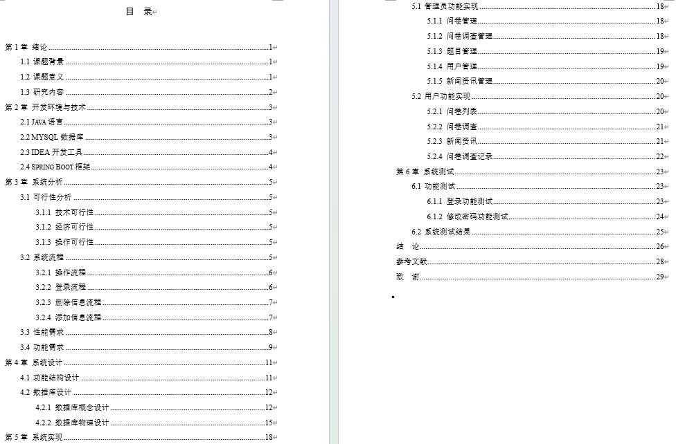
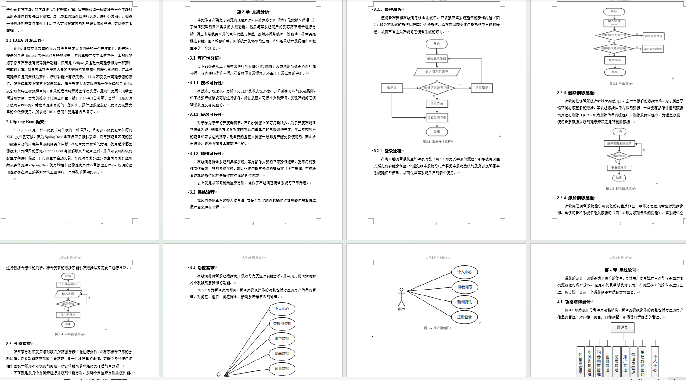
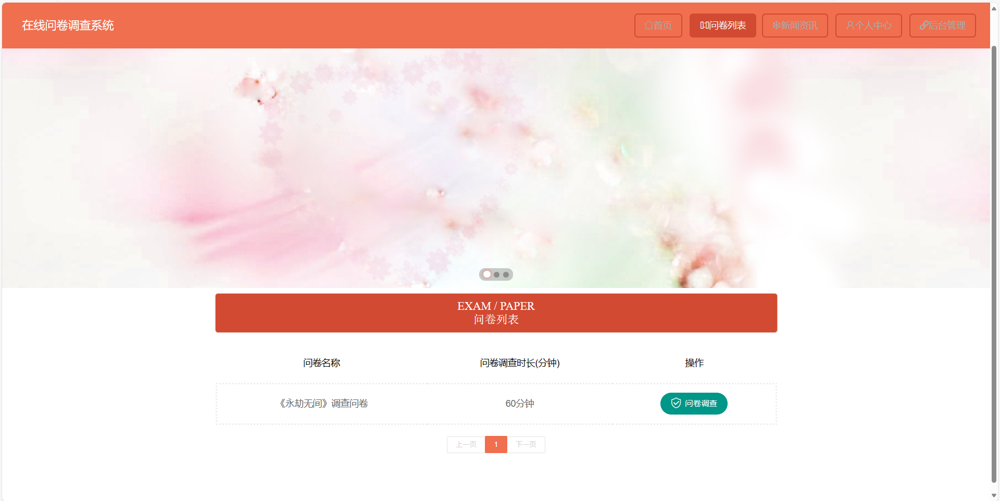
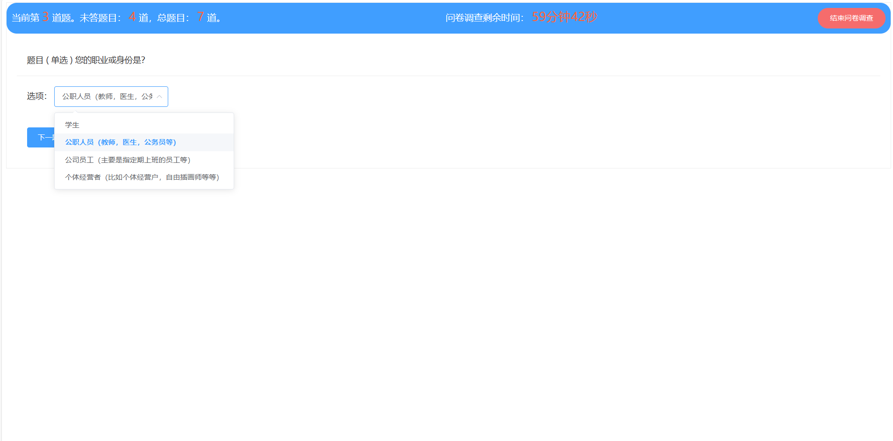
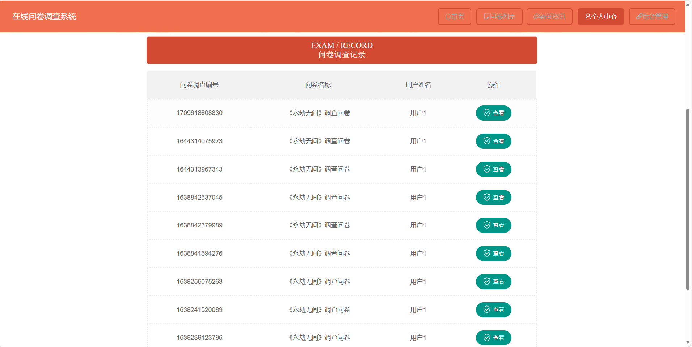
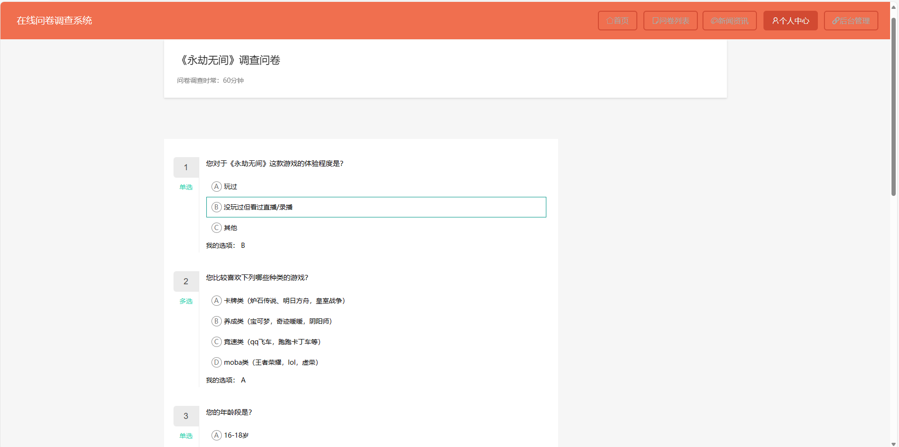
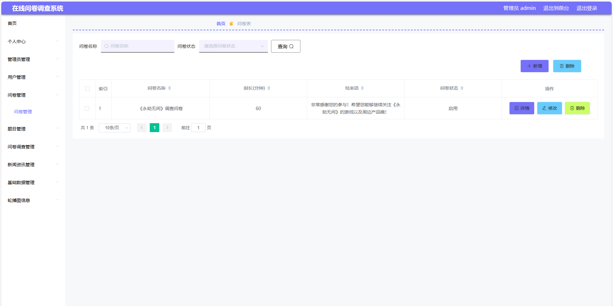
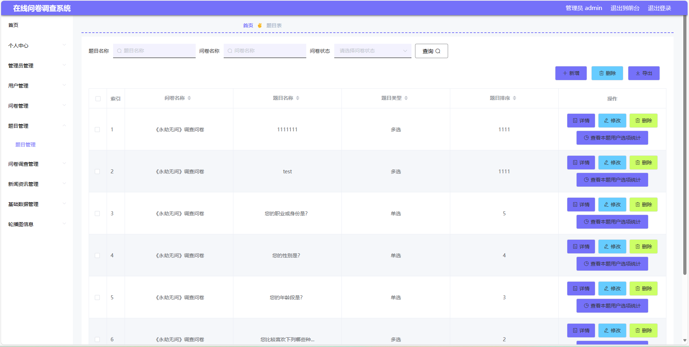

# 在线问卷调查系统带万字文档

## 一、介绍

开发语言：java

运行环境:idea或eclipse 数据库:mysql

框架：Springboot、mybatisplus、Vue、html

### 管理员功能:

登录、个人中心、管理员管理、用户管理、问卷管理、题目管理、问卷调查记录、新闻资讯管理、轮播图管理

### 用户功能:

注册、登录、首页、问卷列表、进行问卷调查、查看问卷调查记录、新闻资讯、个人中心

## 二、12000字论文参考

## 三、部分页面截图展示

